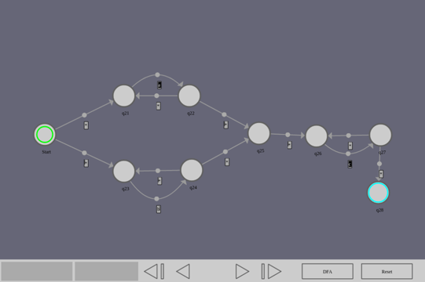

# nfal-sandbox

Tool for visualizing NFA-lambda state machines and converting them to DFAs.

## Build

Install haxe and get openfl from haxelib:
```
haxelib install openfl
haxelib run openfl setup
```

Install haxe libraries used in the project:
```
haxelib install svg
haxelib install haxeui-core
haxelib install haxeui-openfl
```

Build:
```
openfl build html5
openfl deploy html5
```

Run:
```
cd Export/html5/bin && python3 -m http.server &
firefox http://0.0.0.0:8000 
```

## Demo

An nfa-lambda is shown that accepts the regular expression `(a*)|(b*)c*`. It's then converted to a DFA and tested with a few strings.


